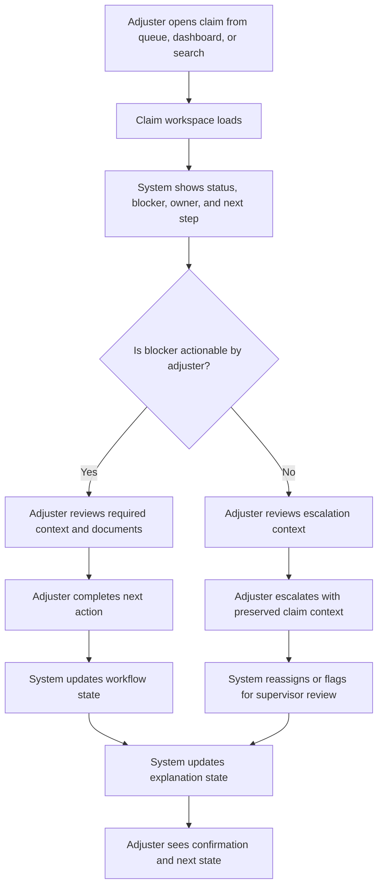
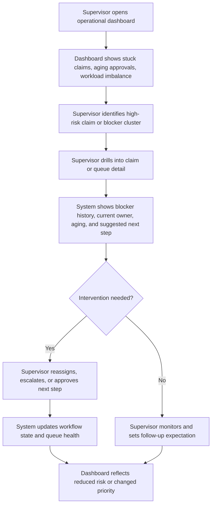
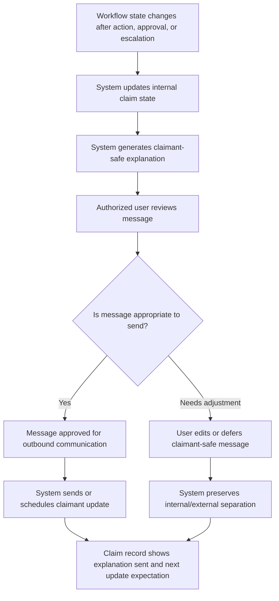

---
stepsCompleted:
  - 1
  - 2
  - 3
  - 4
  - 5
  - 6
  - 7
  - 8
  - 9
  - 10
  - 11
  - 12
  - 13
  - 14
lastStep: 14
inputDocuments:
  - d:/ws/bmad/_bmad-output/planning-artifacts/prd.md
  - d:/ws/bmad/_bmad-output/planning-artifacts/product-brief-ClaimManager.md
  - d:/ws/bmad/_bmad-output/brainstorming/brainstorming-session-2026-05-10-17-01-58.md
---

# UX Design Specification ClaimManager

**Author:** Slouma
**Date:** 2026-05-10

---

<!-- UX design content will be appended sequentially through collaborative workflow steps -->

## Executive Summary

### Project Vision

ClaimManager is a standalone claims workflow platform for insurance carriers designed to make claim handling more legible, more actionable, and more explainable. Its UX must express the product's core thesis: claims systems should guide work, surface intervention points, and communicate progress clearly rather than merely store records and route files.

The first release should prove this through a narrow but high-friction workflow slice centered on payment approval pending. The UX must help internal teams understand what is blocked, who owns the next action, when intervention is needed, and how to communicate progress to claimants safely and clearly.

### Target Users

The primary internal users are claims adjusters and claims supervisors. Adjusters need fast access to claim state, blockers, ownership, and next actions so they can move work forward without reconstructing context manually. Supervisors need live visibility into stuck claims, aging approvals, workload imbalance, and escalation risk so they can intervene early and manage operational flow.

Secondary users include carrier product owners who govern workflow rules and visibility policies, and carrier IT/security stakeholders who evaluate trust, auditability, and integration credibility. Claimants are part of the experience in v1 primarily as recipients of claimant-safe updates and explanations rather than direct workflow operators.

### Key Design Challenges

The UX must make a complex claims workflow understandable without stripping away operational accuracy. It must help adjusters and supervisors act confidently in a trust-sensitive environment where unclear status, late intervention, and poor explanations create both operational and customer harm.

It must also create a claimant-facing communication experience that feels specific and trustworthy while preserving strict separation between internal workflow detail and safe external messaging. Finally, it must support high-information-density desktop workflows without collapsing into clutter or report-style overload.

### Design Opportunities

The strongest UX opportunity is to make next-step clarity the product's defining interaction model. Every important surface should help users understand current state, blocker reason, owner, urgency, and what will move the claim forward.

A second opportunity is to make the supervisor dashboard an intervention workspace rather than a passive reporting screen. A third is to differentiate the claimant experience through precise, human-readable, claimant-safe progress communication that reduces uncertainty and unnecessary inbound contact.

## Core User Experience

### Defining Experience

The core experience of ClaimManager is helping users understand claim progress and act on it without ambiguity. For internal users, this means they should be able to open a claim and immediately understand the current blocker, the owner of the next action, and what needs to happen next. For claimants, this translates into a credible, claimant-safe understanding of progress that reduces the need to call support for updates.

The UX should therefore be built around workflow legibility rather than generic case administration. The product succeeds when internal clarity produces external trust: adjusters and supervisors can interpret claim state quickly, and claimants receive explanations that feel specific rather than generic.

### Platform Strategy

ClaimManager should feel like a hybrid between a case-handling workbench, a workflow oversight control tower, and a guided task system. Adjusters need focused operational work surfaces. Supervisors need high-signal oversight and intervention controls. The system overall must guide users toward the next meaningful action instead of forcing them to reconstruct context from scattered screens and notes.

Because this is a desktop-oriented MPA for enterprise users, the platform strategy should prioritize information density, clear hierarchy, rapid navigation, and visibility into state, ownership, and blockers across workflows.

### Effortless Interactions

The most important effortless interaction is finding the current blocker. Users should not need to infer why a claim is stalled by piecing together notes, approvals, and disconnected status fields. The blocker, its meaning, its owner, and its consequence should be immediately visible.

A second effortless interaction is understanding the next step. The system should reduce decision fatigue by showing what should happen next and which action or event will move the claim forward. This should feel natural, not like reading workflow documentation inside the product.

### Critical Success Moments

A defining success moment for internal users is when an adjuster no longer has to reconstruct claim state from multiple notes and systems before taking action. The system should make the operational picture legible fast enough that the user feels oriented immediately.

A defining success moment for the claimant experience is when a claimant receives a credible explanation instead of silence. The explanation should make progress understandable without exposing unsafe internal detail. If that moment feels generic, the experience fails even if the workflow is technically functioning.

### Experience Principles

- Make workflow state legible before asking users to act.
- Surface blockers and next actions before exposing secondary detail.
- Treat supervisor oversight as an intervention experience, not a reporting experience.
- Turn internal clarity into claimant-safe transparency.
- Reduce cognitive reconstruction by making the system explain the workflow, not just store it.

## Desired Emotional Response

### Primary Emotional Goals

The primary emotional goal of ClaimManager is clarity. The product should reduce ambiguity for every user type and replace guesswork with understandable progress, visible blockers, and credible next steps.

For adjusters, the desired feeling is clarity: they should feel oriented immediately when opening a claim and confident that they understand what is happening and what action matters next.

For supervisors, the desired feeling is early confidence. The dashboard and oversight experience should help them feel ahead of problems rather than reactive to them.

For claimants, the desired feeling is being reassured and informed. The system should reduce anxiety by making progress understandable and by communicating in a way that feels specific, respectful, and credible.

### Emotional Journey Mapping

When internal users first encounter the product, they should feel that the system is understandable rather than dense or opaque. During active claim work, adjusters should feel clear-headed and directed rather than burdened by reconstruction effort. During oversight and intervention, supervisors should feel that risks are visible early enough to manage with confidence.

For claimants, emotional success happens when an update feels like a real explanation rather than a generic status message. The desired journey is a move from uncertainty toward reassurance, supported by information that feels specific enough to trust without exposing unsafe internal details.

When users return to the product, they should feel continuity and orientation rather than needing to re-learn context each time.

### Micro-Emotions

The most important micro-emotions for ClaimManager are confidence over confusion, trust over skepticism, and reassurance over anxiety. For internal users, small moments of certainty matter: seeing a blocker clearly, understanding who owns the next step, and knowing what will move a claim forward.

For claimants, the key micro-emotion is relief from silence. Even when the claim is still pending, the experience should feel communicative and credible rather than passive or evasive.

### Design Implications

If the product is meant to create clarity, the interface must expose state, blockers, ownership, and next actions before secondary detail. If the product is meant to create early confidence for supervisors, the dashboard must prioritize operational risk signals over passive reporting. If the product is meant to reassure claimants, external communication must feel plain-language, specific, and trustworthy.

The design must actively prevent helplessness and confusion. That means avoiding hidden workflow logic, ambiguous status labels, unexplained delays, and screens that force users to reconstruct meaning from scattered fragments.

### Emotional Design Principles

- Make clarity the first experience, not the reward for digging.
- Help supervisors feel ahead of problems, not trapped behind them.
- Communicate with claimants in a way that reassures through specificity.
- Replace ambiguity with visible state, ownership, and next-step guidance.
- Avoid interactions that create helplessness, silence, or confusion.

## UX Pattern Analysis & Inspiration

### Inspiring Products Analysis

Asana is a strong reference for ClaimManager because it handles work progression, filtering, and triage with a sense of control rather than overload. Its strength is not just task tracking, but the way it helps users understand what needs attention, what is blocked, and what belongs to whom without forcing excessive interpretation.

Notion is a useful reference for information clarity and calm structure. It demonstrates how dense information can still feel readable and navigable when hierarchy is clear and visual noise is controlled. For ClaimManager, this is relevant because the product must present operational detail without collapsing into clutter or report-style heaviness.

Together, these products suggest a UX direction that values calm dashboards, strong filtering, fast triage, and flexible but understandable movement through work.

### Transferable UX Patterns

**Navigation and hierarchy patterns**
- Use calm, high-signal work surfaces rather than overloaded enterprise dashboards.
- Structure claim views so users can move quickly from overview to blocker detail to next action.
- Prioritize readable hierarchy so operational density does not become visual confusion.

**Interaction patterns**
- Use filtering and search as primary workflow tools, not secondary utilities.
- Support fast triage so users can identify what needs attention without reading every record in full.
- Use drag-and-drop only where it makes workflow state changes feel more direct and less bureaucratic.

**Visual and cognitive patterns**
- Keep the interface calm and legible even when the underlying workflow is complex.
- Make important state information visible first and secondary detail reveal progressively.
- Use layout and emphasis to support confidence and orientation rather than sheer information volume.

### Anti-Patterns to Avoid

ClaimManager should avoid feeling like ServiceNow or SAP HANA. The UX should not feel overly administrative, visually dense without hierarchy, or built around system complexity rather than user understanding.

Specific anti-patterns to avoid:
- screens overloaded with tables, controls, and metadata before users understand what matters
- navigation structures that make users drill through layers of administration before taking action
- interfaces that feel like configuration consoles instead of operational decision tools
- visually heavy dashboards that create monitoring fatigue instead of confidence

### Design Inspiration Strategy

**What to adopt**
- Calm, high-signal dashboard behavior inspired by Asana
- Strong search and filtering as first-class workflow tools
- Clear information hierarchy inspired by Notion
- Fast triage patterns that reduce the effort required to locate work that matters

**What to adapt**
- Drag-and-drop should be adapted carefully for workflow management where it improves directness without reducing auditability or operational clarity
- Flexible information presentation should be adapted for a trust-sensitive claims environment where visibility rules and role boundaries matter more than open-ended customization

**What to avoid**
- Heavy enterprise UX patterns that make users feel trapped in administration rather than supported in decision-making
- Dashboard and record views that prioritize system structure over user orientation
- Interaction models that create cognitive overload before users can identify blockers, owners, and next steps

## Design System Foundation

### 1.1 Design System Choice

ClaimManager should use a themeable design system with mature, ready-made enterprise-friendly components rather than a fully custom system or a rigid off-the-shelf visual identity. The design system should provide strong defaults for forms, tables, navigation, filters, status indicators, and dashboards while allowing selective customization to support the product's calm, high-signal workflow style.

This approach fits the product's need for a balanced outcome: fast implementation with enough visual and interaction flexibility to avoid feeling like a generic legacy enterprise tool.

### Rationale for Selection

A themeable system is the best fit because ClaimManager needs both delivery speed and a credible but differentiated operational UX. A fully custom system would increase cost and complexity too early, while a rigid established system risks making the product feel too close to the kinds of enterprise tools the UX is explicitly trying not to emulate.

Ready-made patterns are appropriate for v1 because the product's differentiation should come primarily from workflow clarity, blocker visibility, triage quality, and claimant-safe communication rather than from inventing highly custom UI primitives. The product needs a stable foundation more than novel component engineering.

### Implementation Approach

The implementation should begin with a mature component library that supports enterprise application patterns well, including structured navigation, data-dense work surfaces, filtering, tables, forms, status indicators, and accessible interaction states. The team should use the system's existing components wherever they support the desired workflow clearly and consistently.

Custom work should focus on higher-value workflow patterns rather than basic UI primitives. In particular, ClaimManager should invest in custom composition around claim state panels, blocker presentation, next-step guidance, supervisor intervention views, and claimant-safe communication modules.

### Customization Strategy

Customization should happen primarily at the design-token and workflow-pattern level rather than by redesigning the full component foundation. The system should be themed to create a calmer, more legible, less over-administered experience than typical enterprise software.

The visual strategy should emphasize:
- calm, high-signal layouts
- clear hierarchy in dense information views
- readable status and blocker presentation
- restrained but meaningful use of emphasis
- workflow-first compositions that reduce cognitive reconstruction

The goal is not maximum visual uniqueness. The goal is a distinct enough operational feel that ClaimManager is experienced as clear, trustworthy, and intervention-oriented rather than generic.

## 2. Core User Experience

### 2.1 Defining Experience

The defining experience of ClaimManager is opening a claim and immediately understanding what is happening, what is blocked, who owns the next action, and what should happen next. The product should feel clear and intuitive even on first use, especially for users accustomed to fragmented claims workflows.

This interaction is the core expression of the product's value. If ClaimManager makes the current state legible and the next action obvious, the broader experience of guidance, intervention, and claimant-safe transparency becomes believable.

### 2.2 User Mental Model

Users currently solve this problem by jumping between multiple systems, piecing together claim context from notes, statuses, documents, and disconnected operational tools. Their mental model is not "the system will tell me what matters." It is "I need to reconstruct the story myself."

ClaimManager must deliberately reverse that expectation. The user's mental model should shift from reconstruction to orientation: opening a claim should immediately answer what state the claim is in, why it is blocked if stalled, who owns the next step, and what action can move it forward.

### 2.3 Success Criteria

The defining interaction succeeds when users feel that the next action is obvious. They should not need to interpret multiple screens, infer hidden workflow logic, or search across systems to understand what matters.

A successful experience means:
- the claim state is understandable at a glance
- the blocker is visible and meaningful
- the owner of the next action is clear
- the available next step is apparent without extra reconstruction
- the transition from internal action to claimant-safe explanation feels coherent

### 2.4 Novel UX Patterns

ClaimManager should combine familiar enterprise patterns in a new way rather than inventing an entirely novel interaction model. The product should use recognizable workbench, dashboard, and guided-task patterns so that users do not require extensive education to become productive.

The innovation comes from composition: bringing status, blocker, owner, next step, escalation path, and claimant-safe explanation into one coherent interaction model. The experience should feel familiar enough to learn quickly but meaningfully different from fragmented existing claims tools.

### 2.5 Experience Mechanics

**Initiation**  
The user opens a claim from a queue, dashboard, search result, or escalation view.

**Interaction**  
The claim view immediately presents status, blocker, owner, and next step in a clear hierarchy. The user can then either take the next action directly or escalate when appropriate.

**Feedback**  
The system makes it obvious that the action has been understood and processed by updating the claim's workflow state and explanation state. The user should feel confident that the claim has progressed, changed ownership, or entered escalation as intended.

**Completion**  
The interaction completes when the user has either advanced the claim or escalated it with clear context preserved. As part of that completion, the claimant-safe message becomes available so the external explanation stays aligned with the internal workflow truth.

## Visual Design Foundation

### Color System

ClaimManager should use a restrained, calm color system built for trust, legibility, and operational clarity rather than visual excitement. The primary palette should lean toward stable, reassuring hues with one sharper operational accent for action and focus. The color strategy should avoid loud saturation, overly dark enterprise heaviness, and decorative gradients that reduce clarity in dense workflows.

The system should use semantic color deliberately:
- a calm primary color for navigation, key actions, and structural emphasis
- neutral tones for workspace surfaces, panels, and dense information views
- a distinct but controlled accent for active workflow focus
- clear semantic colors for success, warning, error, and blocked states
- status colors that are readable and differentiated without turning the product into a heatmap

The goal is a product that feels composed and trustworthy while still helping users identify urgency, blockers, and progress quickly.

### Typography System

ClaimManager should use a modern, crisp typography system with strong screen readability and clean hierarchy. The type should feel contemporary and precise, not traditional or bureaucratic. It should support fast scanning, confident reading, and clear separation between primary workflow information and secondary detail.

The typography hierarchy should emphasize:
- highly legible headings for page context and workflow sections
- compact but readable labels for operational metadata
- clear body text for notes, claimant-safe explanations, and supporting detail
- strong numeric and status readability for dashboards, aging indicators, and ownership/state information

Type choices should support a professional but not cold tone. The system should feel controlled, current, and easy to parse under operational pressure.

### Spacing & Layout Foundation

The layout should feel airy and spacious while still supporting operational work. That means generous spacing should be used to improve comprehension and reduce cognitive overload, not to create emptiness. The interface should avoid cramped enterprise density, but it must still keep critical workflow information visible and connected.

The spacing strategy should emphasize:
- strong separation between major workflow regions
- clear grouping of related claim information
- visual breathing room around blockers, next actions, and status signals
- progressive disclosure so secondary detail does not compete with the primary task
- layout structures that make claim state, ownership, blocker reason, and next step easy to scan

A consistent base spacing unit should drive component rhythm and page structure. The product should use whitespace as a tool for orientation and confidence, not decoration.

### Accessibility Considerations

The visual system must support readability and confidence for enterprise users working through dense, high-stakes workflows. Contrast, hierarchy, and spacing should be strong enough that users can distinguish state, urgency, ownership, and action priority without ambiguity.

Accessibility considerations should include:
- sufficient contrast across text, controls, and status indicators
- strong visual distinction between primary actions, secondary actions, and passive information
- typography sizes and weights that remain readable in information-dense contexts
- color usage that supports meaning without relying on color alone
- spacing and hierarchy that improve scanning for keyboard and assistive-technology users as well as mouse users

The product should feel accessible through clarity, not merely compliant through checklists.

## Design Direction Decision

### Design Directions Explored

The design exploration considered six visual and interaction directions for ClaimManager, ranging from supervisor-first operational dashboards to claim-centered workspaces, guidance-first feeds, triage boards, claimant-trust views, and highly compressed task-focused layouts.

Across those variations, three directions emerged as the strongest fit for the product's goals:
- Control Tower Calm for calm, high-signal oversight and intervention
- Claim Story Workspace for immediate claim-level clarity and next-step orientation
- Claimant Trust Lens for making claimant-safe transparency visible and credible within the product experience

### Chosen Direction

ClaimManager should combine Directions 1, 2, and 5 into a unified design direction.

The product should use a calm, supervisory control-tower structure for high-level oversight and intervention. Within that structure, individual claim views should behave like claim story workspaces where users can immediately understand status, blocker, owner, next step, and operational context. The experience should also preserve a visible claimant-trust layer that shows how internal workflow truth becomes claimant-safe explanation without exposing unsafe internal detail.

### Design Rationale

This direction best supports the product's defining UX goals: clarity, early confidence, and reassurance. Direction 1 provides the strongest foundation for the supervisor experience, which is critical to the product's differentiation around bottleneck visibility and intervention. Direction 2 provides the best expression of the adjuster experience, where the system must replace fragmented reconstruction with immediate orientation. Direction 5 ensures that claimant-safe transparency remains a visible part of the experience model rather than a hidden communication output.

Together, these directions create a balanced product that feels calm and operational at the top level, clear and actionable at the claim level, and trustworthy in how it translates internal state into external explanation.

### Implementation Approach

The overall application structure should follow the calm, high-signal oversight model of Direction 1, with dashboards and queue views acting as entry points into work. Claim-level screens should adopt the clarity and operational storytelling of Direction 2, ensuring that users can move from overview to action without reconstructing context manually. Claimant-safe messaging and explanation surfaces should draw from Direction 5 so the relationship between internal truth and external communication remains deliberate and understandable.

This approach should be implemented as one coherent system rather than separate visual modes. The combined direction should feel like a single product language with different emphases for oversight, action, and explanation.

## User Journey Flows

### Adjuster Flow: Open Claim, Understand Blocker, Move Work Forward

This is the defining internal-user flow. The adjuster should not have to reconstruct the claim story from notes, systems, and stale statuses. The experience should begin with immediate orientation and move quickly into action.

**Flow goals**
- show the claim state clearly on entry
- make the blocker meaningful, not just labeled
- make the next action obvious
- preserve context when the user acts or escalates

**Key UX requirements**
- the claim workspace must answer "what is blocked?" before showing secondary detail
- the next action must be visible without scrolling through unrelated metadata
- escalation should feel like a controlled transition, not a failure state
- confirmation must make progress legible immediately after action

### Supervisor Flow: Detect Stuck Claim, Intervene Early

This flow turns the dashboard into an intervention workspace rather than passive reporting. The supervisor should feel early confidence, not reactive stress.

**Flow goals**
- surface risk before service failure
- show which claim or pattern deserves attention first
- support intervention without losing operational context
- reduce the need for blind follow-up

**Key UX requirements**
- the dashboard must emphasize risk, not just volume
- drill-down must preserve the relationship between summary signal and claim detail
- intervention controls should feel direct and high-confidence
- supervisors should understand effect of action immediately after intervening

### Claimant-Safe Update Flow: Generate, Review, and Communicate Explanation

This flow is where internal clarity becomes external trust. The product should help teams communicate progress credibly without exposing unsafe operational detail.

**Flow goals**
- derive claimant-safe explanation from workflow truth
- make the generated explanation understandable and reviewable
- ensure internal-only details remain protected
- support timely communication when the workflow changes

**Key UX requirements**
- internal truth and claimant-safe translation must feel connected but clearly separated
- the message-review surface must make trust and safety legible
- sending an update should feel like the final step of a coherent workflow, not a detached communication task
- the record should clearly show what was communicated and why

### Journey Patterns

Across these flows, several reusable UX patterns emerge:

**Navigation patterns**
- dashboard, queue, and search should all serve as valid claim entry points
- users should move from summary to detail without losing context
- claim state and next action should remain visible across work surfaces

**Decision patterns**
- the system should always expose the blocker before asking the user to decide
- the next action should be framed as a guided operational choice
- escalation should preserve context automatically rather than requiring restatement

**Feedback patterns**
- every action should result in visible workflow-state change
- the system should confirm not only that an action succeeded, but what changed next
- claimant-safe explanation state should update as part of workflow completion, not as a disconnected afterthought

### Flow Optimization Principles

- orient the user before asking for action
- reduce reconstruction by showing blocker, owner, and next step together
- preserve context across drill-down, action, and escalation
- make system feedback stateful, not generic
- keep communication aligned with workflow truth
- optimize for first-use clarity without sacrificing operational density

## Component Strategy

### Design System Components

ClaimManager should rely on the chosen themeable design system for standard enterprise UI foundations. This includes layout primitives, navigation shells, tables and data grids, forms and field controls, buttons, menus, drawers, modals, tabs, badges, alerts, chips, search inputs, pagination, and standard content containers.

These components should provide the structural backbone of the product so the team can move quickly without spending design and engineering effort on solved UI problems. They should be themed to support the product's calm, spacious, high-signal operational style, but not fundamentally reinvented.

### Custom Components

The following custom components should be treated as core to the product experience because they directly express ClaimManager's workflow value proposition.

#### Claim State Summary Panel

**Purpose:** Provide immediate orientation when a user opens a claim.  
**Usage:** Appears at the top of the claim workspace and other relevant detail views.  
**Anatomy:** Claim state, blocker, owner, next action, urgency, and explanation status.  
**States:** Default, blocked, actionable, escalated, completed, stale-data warning.  
**Variants:** Adjuster view, supervisor view.  
**Accessibility:** Clear heading hierarchy, status announced textually, keyboard focus support.  
**Content Guidelines:** Show primary workflow meaning before secondary metadata.  
**Interaction Behavior:** Supports quick drill-in to deeper context without losing the main claim picture.

#### Blocker Card

**Purpose:** Make blockers explicit, understandable, and actionable.  
**Usage:** Within claim views, queues, dashboards, and intervention panels.  
**Anatomy:** Blocker type, plain-language meaning, owner, aging, consequence, recommended action.  
**States:** Informational, warning, critical, resolved.  
**Variants:** Compact queue version, expanded claim-detail version.  
**Accessibility:** Do not rely on color alone to communicate blocker severity.  
**Content Guidelines:** Use operationally meaningful language, not abstract status codes.  
**Interaction Behavior:** Allows users to move from blocker identification to next action quickly.

#### Next-Step Guidance Card

**Purpose:** Show what should happen next and reduce decision fatigue.  
**Usage:** Claim workspace, dashboard drill-down, task feed.  
**Anatomy:** Recommended next action, reason, responsible owner, expected result, escalation trigger if ignored.  
**States:** Suggested, urgent, unavailable, completed.  
**Variants:** Read-only guidance, action-enabled guidance.  
**Accessibility:** Action labels must be explicit and keyboard accessible.  
**Content Guidelines:** Phrase as clear operational guidance, not system jargon.  
**Interaction Behavior:** Supports direct action where appropriate and routes to escalation when needed.

#### Claimant-Safe Explanation Panel

**Purpose:** Translate internal workflow truth into externally safe, understandable progress communication.  
**Usage:** Claim detail view, communication review flow, outbound update workflow.  
**Anatomy:** Internal state reference, claimant-safe message, review status, next-update expectation.  
**States:** Drafted, approved, deferred, sent.  
**Variants:** Inline preview, dedicated review panel.  
**Accessibility:** Keep internal and external content clearly separated for comprehension and safety.  
**Content Guidelines:** Explanations must feel specific, respectful, and credible without leaking unsafe detail.  
**Interaction Behavior:** Supports review, approval, and confirmation of outbound communication.

#### Supervisor Intervention Panel

**Purpose:** Let supervisors act on risk without losing context.  
**Usage:** Dashboard drill-downs, stuck-claim reviews, queue intervention moments.  
**Anatomy:** Claim summary, blocker history, current owner, risk level, intervention options, expected impact.  
**States:** Monitoring, intervention recommended, intervention in progress, resolved.  
**Variants:** Single-claim panel, grouped blocker pattern panel.  
**Accessibility:** Emphasize action clarity and readable hierarchy under dense information conditions.  
**Content Guidelines:** Prioritize risk, actionability, and accountability over passive reporting.  
**Interaction Behavior:** Supports reassignment, escalation, approval, or monitored follow-up.

#### Workflow Timeline / Claim Story Strip

**Purpose:** Show the operational story of the claim as a coherent sequence rather than scattered notes.  
**Usage:** Claim workspace and investigation contexts.  
**Anatomy:** Key workflow events, timestamps, state changes, decisions, and communication milestones.  
**States:** Current, past, exception-marked, warning-linked.  
**Variants:** Compact timeline, expanded narrative strip.  
**Accessibility:** Sequence must remain understandable in text and structure without visual timeline cues alone.  
**Content Guidelines:** Highlight meaningful workflow changes, not every low-level event.  
**Interaction Behavior:** Supports quick scanning of how the claim reached its current state.

### Component Implementation Strategy

The implementation strategy should favor standard design-system components for generic interface scaffolding and reserve custom component work for workflow-defining modules. Every custom component should be built using the design system's tokens, spacing rules, type hierarchy, and interaction conventions so the product feels unified rather than patched together.

Custom components should be treated as reusable workflow primitives, not one-off screens. The claim state summary panel, blocker card, next-step guidance card, claimant-safe explanation panel, supervisor intervention panel, and workflow timeline should form the product's true interaction language.

### Implementation Roadmap

**Phase 1 - Core Components**
- Claim state summary panel
- Blocker card
- Next-step guidance card
- Workflow timeline / claim story strip

These components support the defining internal-user flow and should be designed and implemented first.

**Phase 2 - Trust and Intervention Components**
- Claimant-safe explanation panel
- Supervisor intervention panel

These should follow immediately because they express the product's external trust model and supervisory differentiation.

**Phase 3 - Supporting Enhancements**
- Additional variants and supporting patterns derived from the core custom components
- Extensions for broader decision-state coverage beyond the initial payment approval slice

## UX Consistency Patterns

### Button Hierarchy

Primary actions should represent the next meaningful workflow move. In claim workspaces, there should usually be one dominant action aligned with the current next step, such as progress, escalate, approve, or send claimant-safe update.

Secondary actions should support context management, review, or optional follow-up without competing visually with the primary workflow move. Destructive or high-risk actions should be clearly differentiated and used only where the operational consequence justifies strong emphasis.

Blocked or risky states should use a balanced action tone: the interface should clearly direct the user toward the appropriate intervention without creating visual panic or excessive urgency inflation.

### Feedback Patterns

System feedback should always explain both what happened and what changed next. A successful action should not end with a generic confirmation; it should show the updated workflow state, ownership, or explanation state so users understand the consequence of their action.

Warning states should feel calm and explanatory first, then directive where needed. Error states should clearly identify what failed, what remains unchanged, and what the user can do next. Blocked states should emphasize operational meaning rather than raw system status.

Claimant-safe explanation generation and message approval should have especially clear feedback because trust depends on users understanding whether internal state and outward communication are aligned.

### Form Patterns

Forms should prioritize clarity, sequencing, and operational relevance. Only the fields needed for the current workflow task should be foregrounded. Supporting or secondary fields should be progressively disclosed where possible to reduce cognitive noise.

Validation should appear close to the relevant field or action and should explain what needs correction in plain operational language. The system should prevent users from feeling trapped in long administrative forms when their real goal is to progress the claim.

### Navigation Patterns

Navigation should support three reliable entry modes: dashboard to claim, queue to claim, and search to claim. Users should be able to move from high-level oversight to detailed action without losing orientation.

Global navigation should remain calm and stable, while local navigation inside claim workspaces should prioritize the current state, blocker, timeline, notes, documents, and claimant-safe explanation areas. Navigation should reinforce the product's operational model: summary first, detail second, action always visible.

### Search and Filtering Patterns

Search and filtering should be treated as first-class workflow tools, not secondary utilities. Users should be able to locate claims by identifiers, ownership, blocker state, approval status, aging, and urgency without excessive query construction.

Filters should emphasize operational questions, such as what is blocked, what is aging, what needs attention now, and who owns the next step. Search results and filtered lists should make triage easier immediately rather than forcing more detail clicks before meaning appears.

### Additional Patterns

Empty states should orient users by explaining what belongs in the current view and what action will populate it. They should never feel like dead ends.

Loading states should preserve layout stability and indicate what kind of information is arriving. Users should not lose context while waiting for claim state or dashboard data to load.

No-result states should help users recover by suggesting broader filters, alternate search criteria, or nearby workflow-relevant views.

### Pattern Integration with the Design System

These patterns should sit on top of the chosen themeable design system rather than replacing it. Standard components should handle the visual and structural baseline, while ClaimManager-specific behavior should define how workflow actions, blocked states, next-step guidance, and explanation review behave consistently across screens.

Custom pattern rules should ensure:

- blocker and next-step visibility always outrank decorative detail
- action hierarchy reflects workflow importance, not visual novelty
- risk states guide without overwhelming
- internal truth and claimant-safe communication remain consistently separated but clearly related

## Responsive Design & Accessibility

### Responsive Strategy

ClaimManager should use a desktop-first responsive strategy. The primary user experience is an operational desktop workspace where adjusters and supervisors need to interpret state, blockers, ownership, next steps, timelines, and claimant-safe communication without reconstructing context manually. Desktop layouts should take advantage of larger screen sizes through multi-column compositions, persistent navigation, visible contextual panels, and higher information density where hierarchy remains clear.

Tablet layouts should preserve the product's calm, high-signal structure while reducing simultaneous complexity. Two-column and stacked layouts should be used selectively to keep orientation strong without overwhelming touch users. Tablet should support review, triage, light intervention, and selected workflow actions, but it should not be optimized as the primary environment for the densest claim-handling tasks.

Mobile should support monitoring and lightweight actions only in v1. It should be suitable for checking status, reviewing risk, seeing blockers, approving or acknowledging narrow workflow items, and reviewing claimant-safe explanations. It should not attempt full parity with desktop claim workspaces. On small screens, the most important information should be current claim state, blocker, owner, next step, and urgent intervention cues.

### Breakpoint Strategy

ClaimManager should use standard breakpoints with desktop-first planning and wide-screen optimization for enterprise work surfaces.

Recommended breakpoints:
- Mobile: 320px to 767px
- Tablet: 768px to 1023px
- Desktop: 1024px and above
- Wide desktop optimization: 1440px and above

The product should not simply collapse layouts mechanically across breakpoints. Instead, layouts should adapt by workflow priority. On smaller screens, lower-priority metadata should move behind progressive disclosure while status, blocker, next step, and action priority remain visible as long as possible.

Wide desktop layouts should use additional space to reduce cognitive switching rather than just adding more content. Extra width should support side-by-side visibility of claim summary, workflow history, intervention context, and explanation review where appropriate.

### Accessibility Strategy

ClaimManager should target WCAG AA compliance. This is the appropriate baseline for an enterprise workflow product handling high-stakes claims operations and dense information environments.

Accessibility requirements should include:
- sufficient color contrast for text, controls, statuses, and state indicators
- keyboard navigation across all core workflows
- visible and consistent focus indicators
- screen reader compatibility for navigation, forms, status changes, and workflow surfaces
- semantic structure with clear headings, landmarks, labels, and reading order
- touch targets of at least 44x44px where touch interaction is supported
- status, blocker severity, and workflow meaning never conveyed by color alone
- clear error identification and recovery guidance in forms and workflow actions
- support for zoom and text scaling without loss of critical functionality

Because ClaimManager relies on operational clarity, accessibility should be treated as part of comprehension, not just compliance. Dense enterprise screens must remain understandable for keyboard users, screen reader users, and users who rely on strong visual hierarchy or reduced cognitive load.

### Testing Strategy

Responsive testing should cover the actual product usage model rather than generic screen-size checks alone.

Responsive testing should include:
- desktop testing across Chrome, Edge, and Firefox
- tablet testing on real devices for review, triage, and light intervention scenarios
- mobile testing on real devices for monitoring and lightweight-action scenarios
- validation of wide-screen dashboard and claim-workspace layouts
- testing under reduced viewport sizes without losing primary workflow meaning

Accessibility testing should include:
- automated accessibility scans during development
- keyboard-only testing across all primary workflows
- screen reader testing with tools such as NVDA, JAWS, and VoiceOver where relevant
- focus-order and focus-management validation for drawers, modals, and dynamic workflow states
- color blindness and contrast simulation testing
- text scaling and browser zoom testing for dense claim views

User testing should include users working in realistic operational conditions, especially where dense information, interruptions, and high consequence decisions affect interaction quality.

### Implementation Guidelines

Responsive development should prioritize workflow continuity over raw layout flexibility. The interface should adapt by preserving the most important operational signals first: claim state, blocker, owner, next step, and explanation status.

Implementation guidelines should include:
- use relative sizing units and flexible layout systems rather than rigid fixed-width structures
- apply breakpoint changes based on workflow priority and readability, not only screen width
- preserve the hierarchy of blocker, next action, and ownership during layout collapse
- use progressive disclosure for secondary metadata and supporting detail on smaller screens
- optimize touch interactions for tablet and mobile-specific surfaces
- avoid forcing desktop-density interaction models onto mobile

Accessibility implementation should include:
- semantic HTML as the default structure
- proper labeling for forms, search, filters, and action controls
- ARIA usage only where native semantics are insufficient
- deliberate focus management for overlays, modal workflows, and state changes
- skip links and landmark regions for faster navigation
- explicit textual communication of statuses, blockers, and action results
- accessible error handling and validation messaging
- consistent announcement strategy for important workflow changes in dynamic interfaces

The product should be built so that accessibility and responsiveness reinforce the same UX principle: users should understand what is happening and what to do next, regardless of device or interaction mode.